# 📖 Prompting Techniques with FlowS

## 📝 Instructive Prompting

Direct, task-oriented instructions.

### Example 1: Essay Writing

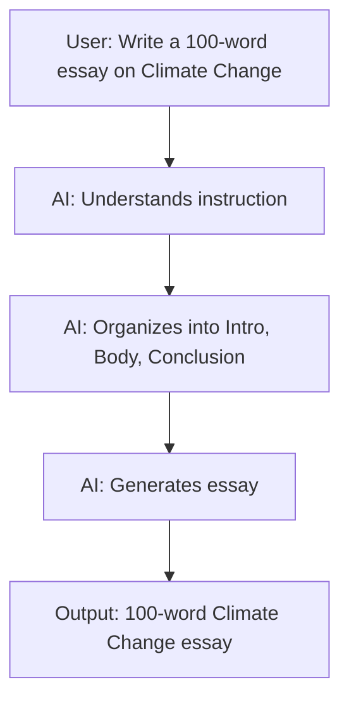

### Example 2: Summarization

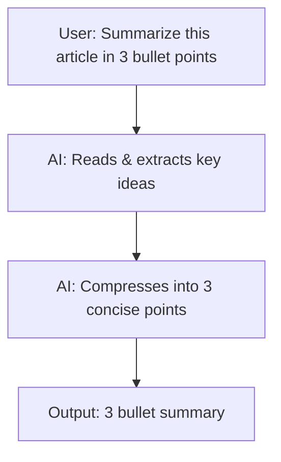

### Example 3: Formal Email

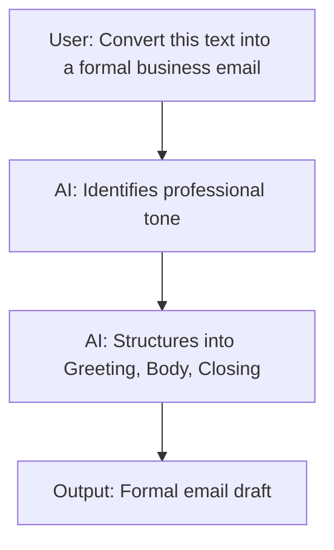

---

## 📚 Informative Prompting

Seeks knowledge, explanation, or definitions.

### Example 1: Simple Explanation

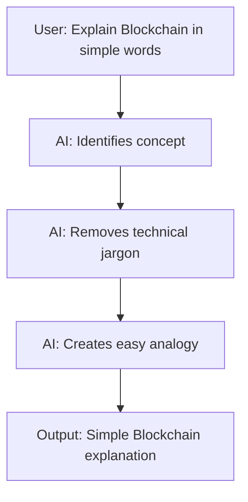

### Example 2: AI vs ML

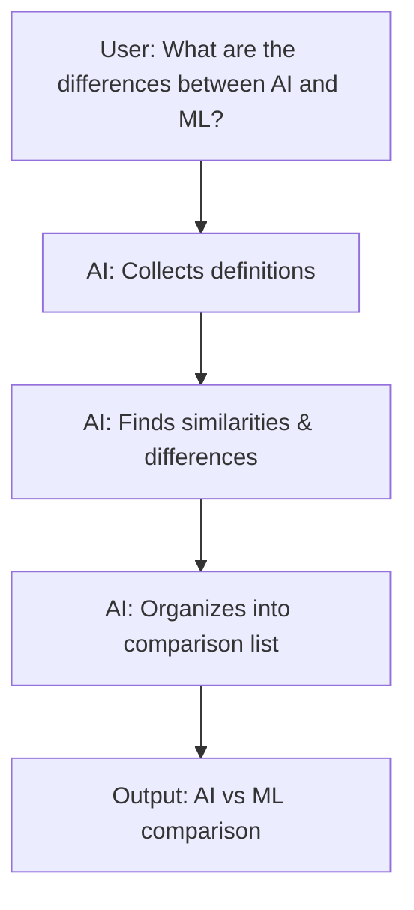

### Example 3: Real-World Use Cases

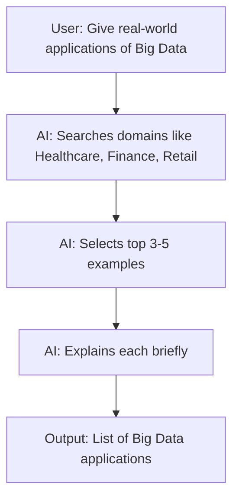

---

## 💬 Conversational Prompting

Engages AI like chatting with a mentor or friend.

### Example 1: Trip Planning

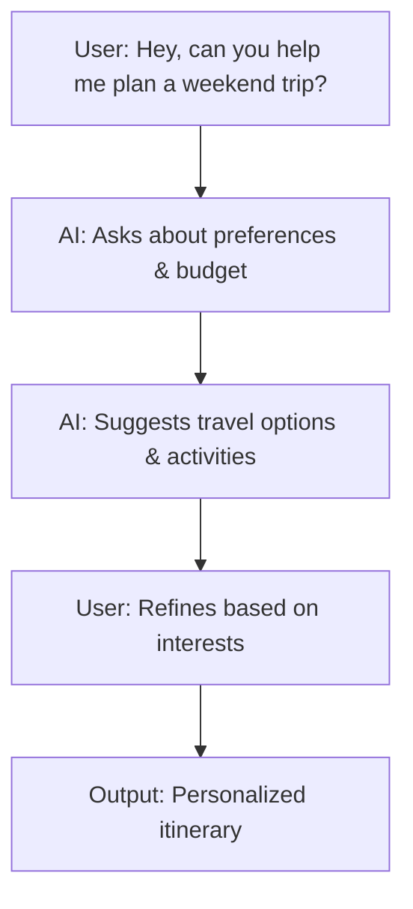

### Example 2: Debugging Help

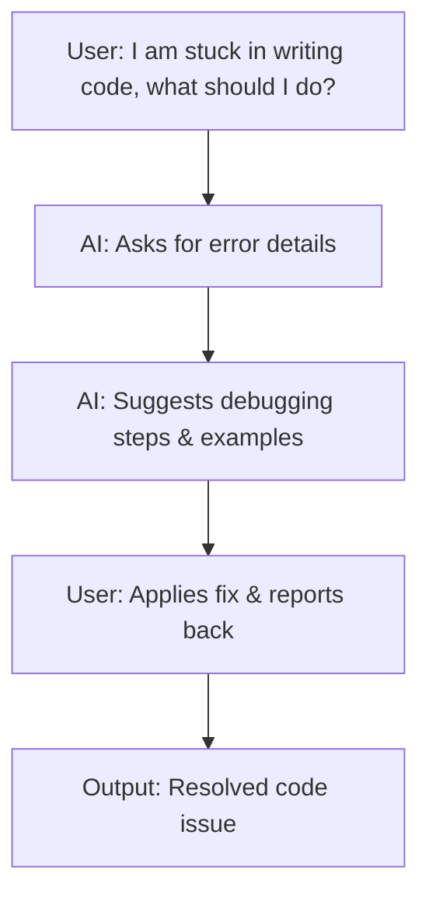

### Example 3: Mentor Guidance

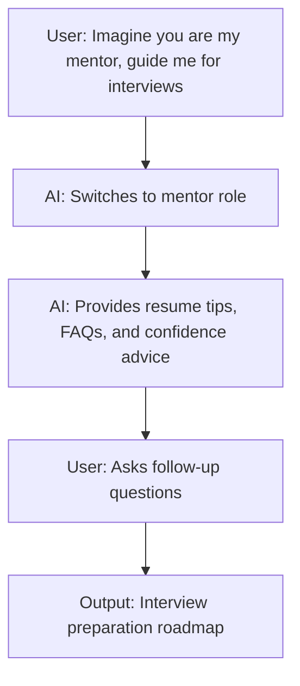

---

## 🎯 Zero-Shot Prompting

No prior examples, just task.

### Example: Translation

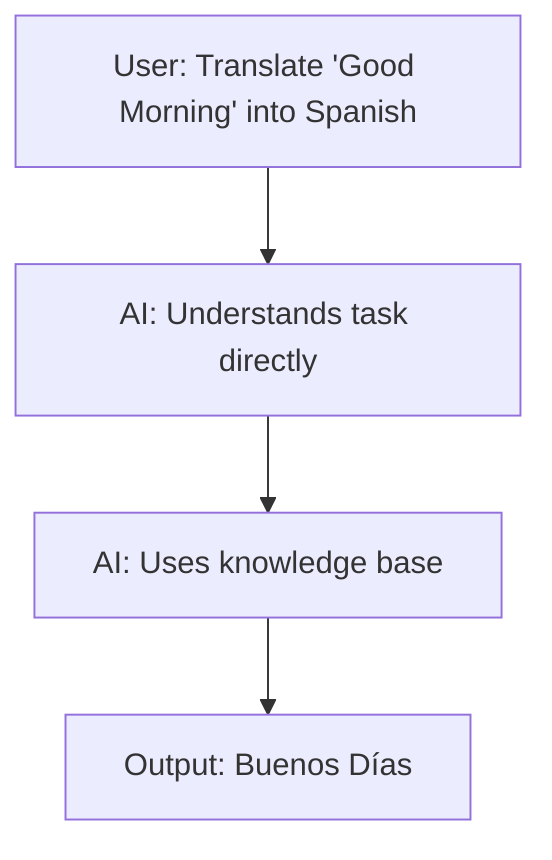

---

## 🎯 Few-Shot Prompting

User provides examples, AI follows pattern.

### Example: Classification

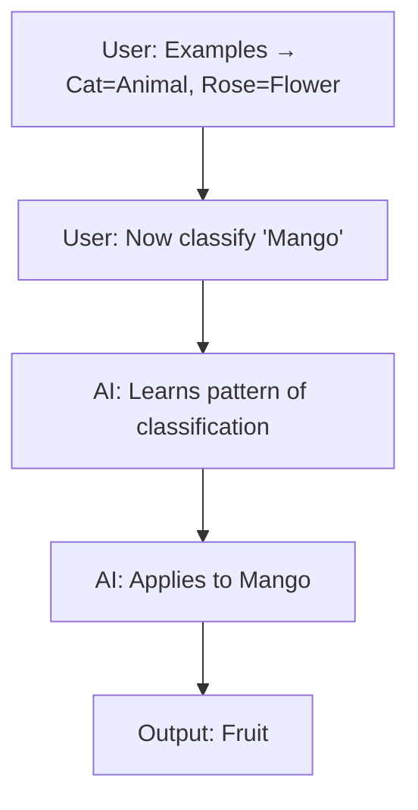

---

## ✅ Best Practices Checklist

### Normal Prompts

* 🎯 Be **specific**
* 🏗️ Define **structure** (list, table, code, essay)
* 🎨 Set **tone/style** (formal, casual, creative)
* ⏳ Add **constraints** (word limit, step-by-step)
* 📚 Provide **context** (background info helps accuracy)

### Claude Prompts

* 👤 Use **role-based prompting** (“You are a career coach…”)
* 🧠 Ask for **step-by-step reasoning** (“Think carefully before answering…”)
* 🏗️ Give **structured instructions** (headings, bullet points)
* 🔒 Be **polite, clear, and safe**

---


# 📖 Prompting Techniques

## ✅ Normal Prompts Best Practices

* 🎯 **Be specific** → Avoid vague instructions.
* 🏗️ **Define structure** → Output format (list, table, essay, code).
* 🎨 **Set tone/style** → Formal, casual, technical, creative.
* ⏳ **Add constraints** → Word limit, step-by-step, exact format.
* 📚 **Provide context** → Background info improves accuracy.

---

## 🤖 Claude Prompts Best Practices

* 👤 **Use role-based prompting** → (“You are a career coach…”)
* 🧠 **Ask for step-by-step reasoning** → (“Think carefully before answering…”)
* 🏗️ **Give structured instructions** → Use headings, bullet points, sections.
* 🔒 **Be polite, clear, and safe** → Direct, respectful instructions.

---

## 📌 Mandatory Elements in Prompts

1. **Context** → Provide background (so AI knows scope).
2. **Role** → Assign AI a persona (teacher, mentor, coder).
3. **Task** → Clearly state what needs to be done.
4. **Examples** → (Optional, but powerful) give few-shot references.

---

## 📝 Sample Prompts (Using All Four Elements)

### 🔹 Example 1: Normal Prompt (Learning Content)

```
Context: I am a beginner learning Python.  
Role: You are a coding tutor.  
Task: Explain how loops work in Python with real-life examples.  
Examples: Show me 2 code snippets (for loop and while loop).  
```

✅ Output → Clear explanation + 2 code snippets.

---

### 🔹 Example 2: Claude Prompt (Interview Preparation)

```
Context: I am preparing for a Data Analyst job.  
Role: You are an interview coach.  
Task: Guide me step by step with:
   - Resume tips
   - 3 common interview questions (with sample answers)
   - 2 practical projects I can showcase  
Examples: Format output with headings and bullet points.  
```

✅ Output → Structured career guide.

---

### 🔹 Example 3: Creative Prompt (Story Writing)

```
Context: I want to write a bedtime story for kids aged 7-10.  
Role: You are a children’s storyteller.  
Task: Write a short story about a curious rabbit who discovers teamwork.  
Examples: Keep it under 200 words, use simple language, and add a moral at the end.  
```

✅ Output → Fun, age-appropriate story with moral.

---

## 🔄 Additional Examples

### 🔹 Example 4: Normal Prompt (Technical Explanation)

```
Context: I am studying networking for an exam.  
Role: You are a computer science teacher.  
Task: Explain the difference between TCP and UDP in simple terms.  
Examples: Provide the explanation in a comparison table with at least 3 points.  
```

✅ Output → Side-by-side TCP vs UDP comparison table.

---

### 🔹 Example 5: Claude Prompt (Project Guidance)

```
Context: I want to build a simple website for my college project.  
Role: You are a web development mentor.  
Task: Suggest a step-by-step plan with:
   - Tech stack to use
   - Basic project features
   - Free hosting options  
Examples: Present it in 3 sections with bullet points.  
```

✅ Output → Roadmap for project development.

---

### 🔹 Example 6: Normal Prompt (Email Drafting)

```
Context: I need to inform my professor about missing a class due to illness.  
Role: You are a professional email assistant.  
Task: Draft a short, polite email.  
Examples: Keep it under 100 words, include subject line, and use formal tone.  
```

✅ Output → Professional, concise email draft.

---

### 🔹 Example 7: Claude Prompt (Learning Roadmap)

```
Context: I want to become a Machine Learning Engineer.  
Role: You are a career advisor.  
Task: Create a 6-month structured learning roadmap with:
   - Key topics
   - Resources (free/paid)
   - Mini-project suggestions  
Examples: Output in a month-wise timeline with bullet points.  
```

✅ Output → Month-wise ML learning plan.

---

## 🎯 Flowchart – How a Strong Prompt Works

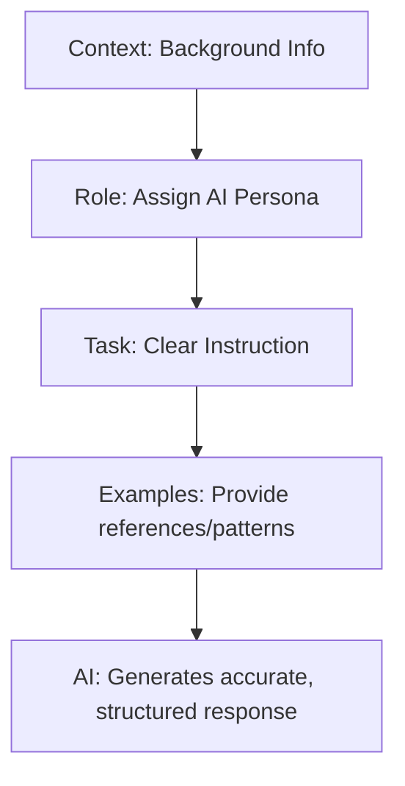

---

✨ **Takeaway:**

* Normal prompts = direct + structured.
* Claude prompts = role-based + step-by-step + structured.
* Always include **Context + Role + Task + Examples** for best results.

---

👉 Do you want me to now **add a side-by-side comparison table (Normal vs Claude prompts with examples)** so your students can instantly see the difference?
